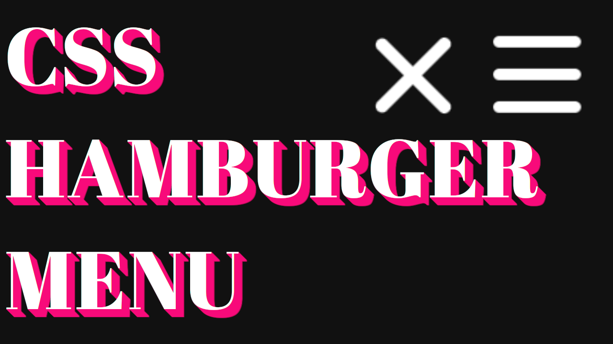

# 🍔 Css Hamburger Menù

<!-- ## Background -->

> Super Simple Css Hamburger Menù.

### 📚 STACK
- Html
- Css
- Javascript

## Installation

Open index.html in your browser.

## 🐛 Bugs

...sure

### Video Guide Link
    
[Video Guide](https://youtu.be/49EmGq1rn38)

## License

Usage is provided under the MIT License. See [LICENSE](https://github.com/Yilber/readme-boilerplate/blob/master/LICENSE) for the full details.
